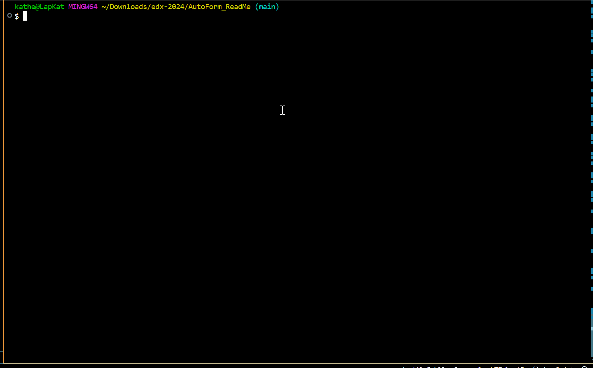

# AutoForm ReadMe
    
## Description
This application takes user responses and creates a ReadMe.md file for their application.

## Table of Contents
- [Description](#description)
- [Installation](#installation)
- [Use](#use)    
- [Credits](#credits)
- [Contributing](#contributing)
- [License](#license)
- [Testing](#testing)

    
## Installation
Clone the github repository, open a CLI terminal, ensure node.js is installed, run npm install, and then run the application. 
    
## Use
To run this application, enter "node index.js" in your CLI, then answer the prompts. When all prompts have been answered, a ReadMe.md file will appear in the application folder. Copy that file and add it to your application. From that file, remove any empty(unused) badges and sections of the ReadMe and Table of Contents.

## Questions
Katherine-Be
katherine.bensley.93@gmail.com
